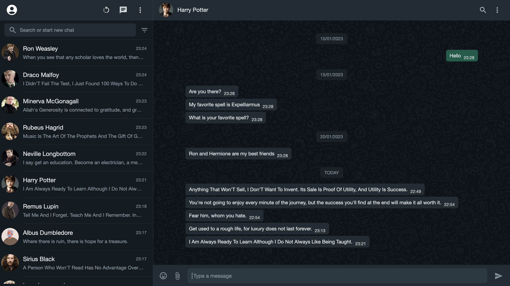

# Chatter Box

Chatter Box is a web application that mimics the WhatsApp UI, allowing users to chat with predefined contacts. This project is built using React, Redux, and Tailwind CSS.

## Features

- **Real-time Messaging**: Send and receive messages in real-time.
- **Typing Indicator**: See when a contact is typing.
- **Message Deletion**: Delete messages for yourself or for everyone.
- **Responsive Design**: Optimized for different screen sizes.
- **Auto Messages**: Contacts send random quotes automatically at intervals.

## Technologies

- **React**: A JavaScript library for building user interfaces.
- **Redux**: A predictable state container for JavaScript apps.
- **Tailwind CSS**: A utility-first CSS framework for rapid UI development.
- **Vite**: A build tool that provides a faster and leaner development experience for modern web projects.
- **MUI (Material-UI)**: A popular React UI framework.

## Screenshots

### Chat Screen



## How to Run

### Prerequisites

- Node.js (v14 or higher)
- npm (v6 or higher)

### Installation

1. Clone the repository:

   ```sh
   git clone https://github.com/your-username/chatter-box.git
   cd chatter-box
   ```

2. Install the dependencies:

   ```sh
   npm install
   ```

### Running the App

1. Start the development server:

   ```sh
   npm start
   ```

2. Open your browser and navigate to:

   ```sh
   http://localhost:3000
   ```
